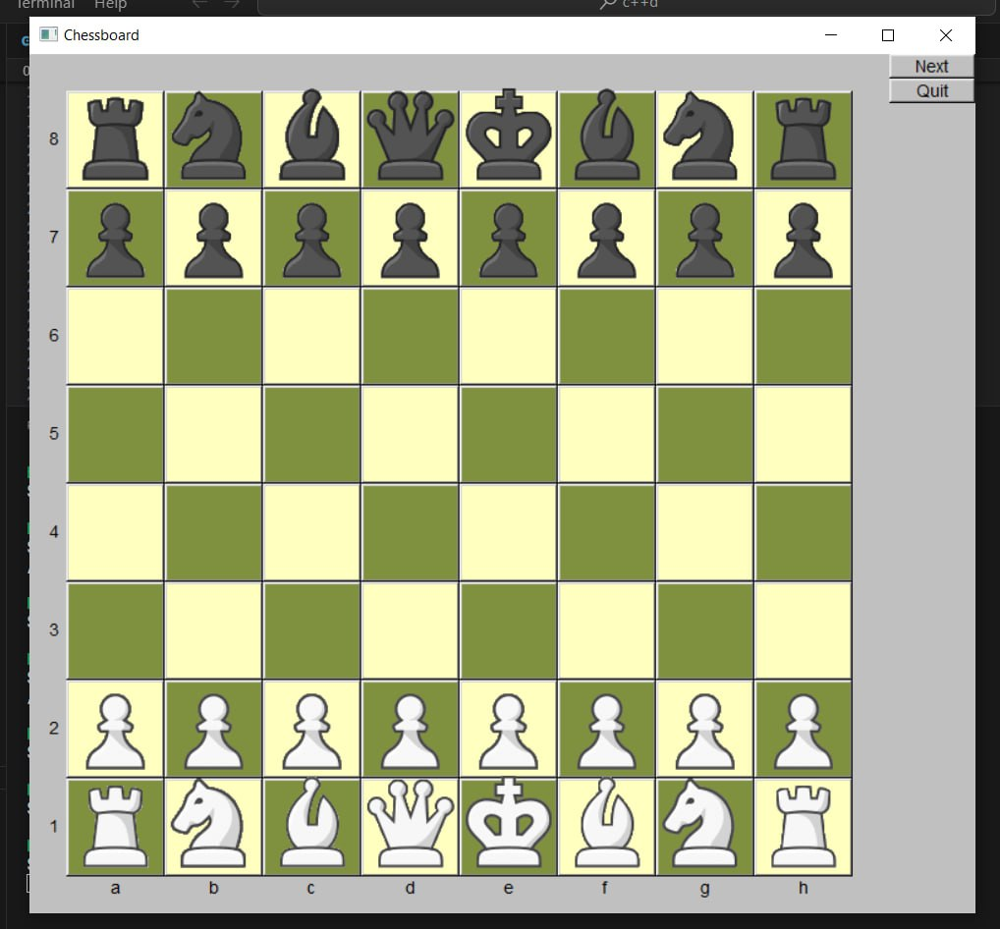
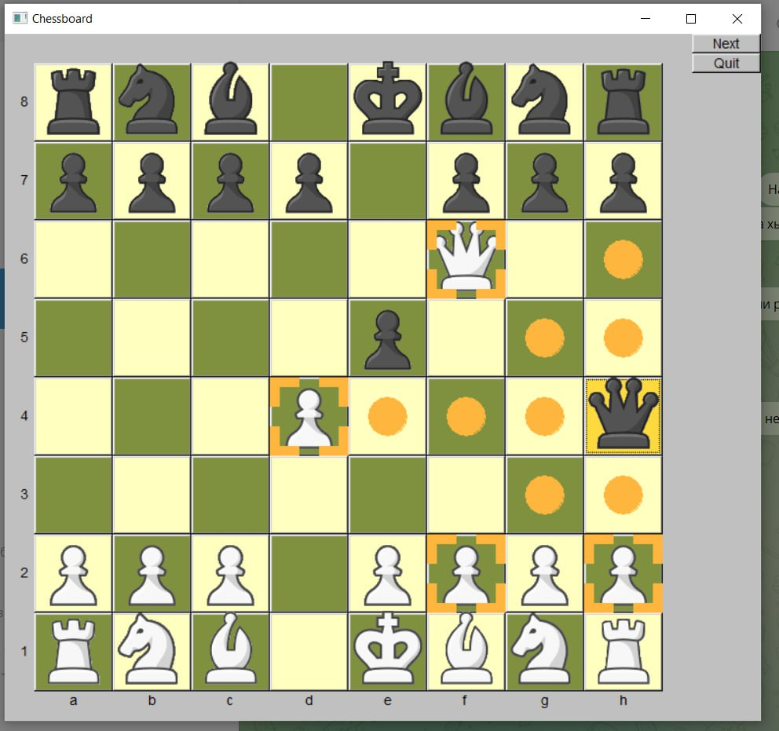
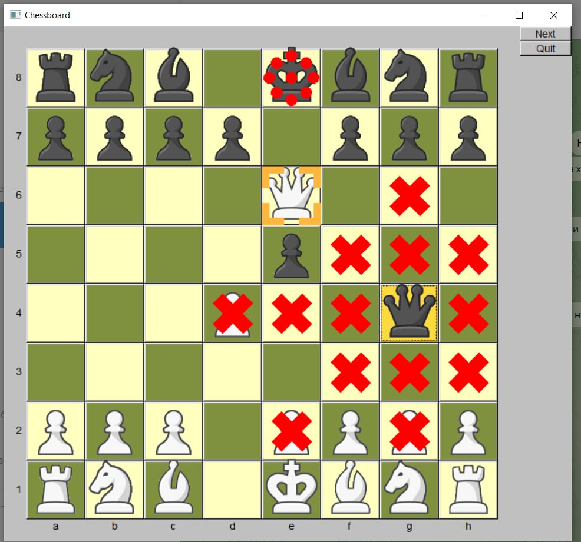

# Шахматы
## Работали над проектом:
* Бучилкин Некита
* Курченко Матвей
* Михаил Рябчиков
# Описание
Игра в шахматы. Чтобы походить фигурой, нужно кликнуть на нее, а затем на клетку, на которую вы хотите её поставить. Допустимые ходы подсвечиваются. Походить против правил не получиться. Ракировка, пат, первый ход пешки на 2 клетки и взятие на проходе присутсвуют. Когда королю шах, произвольно ходить запрещено. Когда королю шах и мат, игра заканчивается. 

# Техническое описание
Проект реализован на C++ с помощью графической библиотеки Graph_lib, основанной на FLTK.

### Обзор основных классов
* Класс Chessboard хранит объекты типа Cell, описывающие клетки.
* Абстрактный класс Figure и производные от него классы Pawn, King, Bishop, Knight, Queen, Rook, в которых переопределены функции correct_step и show_possible_steps, ответственны за проверку и отображение корректных ходов.
* Класс DangerSign при шахе королю, подсвечивает короля. 
* Класс RedCross показывает недоступные при шахе ходы.
* Классы Frame и VisualSteps ответсвенны за отображение на экране допустимых ходов и возможного поедания фигур. 
